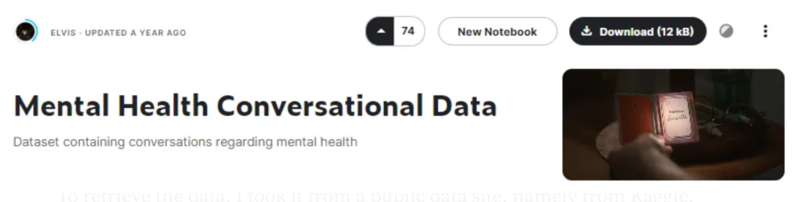
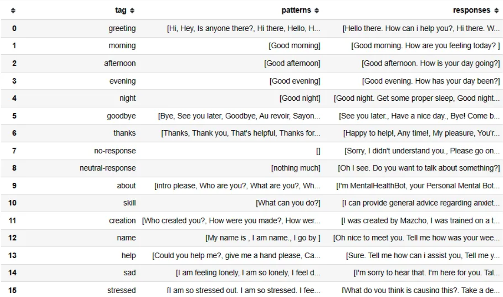
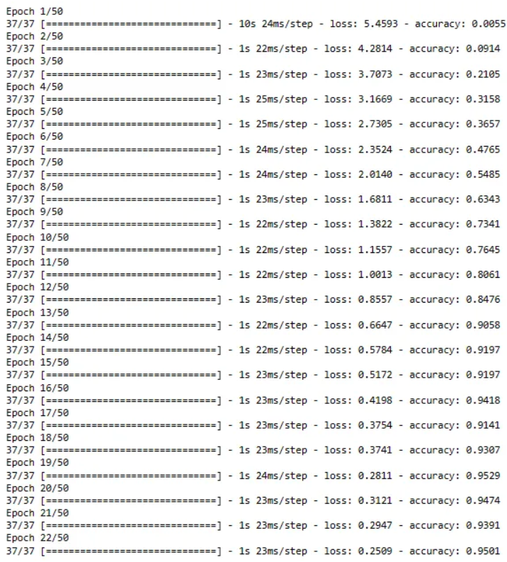

# Implementasi Sequential LSTM Model dalam Chatbot Kesehatan Mental Remaja Menggunakan TensorFlow

## Latar Belakang Projek
Pada tahun 2023, kesehatan mental merupakan masalah terbesar bagi kaum remaja . Banyak kaum remaja yang mengalami berbagai masalah akan tetapi tidak ada yang bisa mendengarkan ceritanya, bahkan di keluarganya sendiri. Tidak semua orang mudah untuk menceritakan apa yang terjadi pada dirinya terhadap orang sekitarnya. Maka dari itu , menggunakan Machine Learning (ML) dan Deep Learning untuk membuat chatbot yang dapat merespon chat dari seseorang yang sedang mengalami masalah. PENDAHULUAN Latar Belakang Kesehatan mental adalah kondisi seorang individu terbebas dari segala bentuk gejala-gejala gangguan mental(1). Pada pertumbuhan di masa remaja, banyak terjadi perubahan biologis, psikis, maupun dari segi sosial(2). Kesehatan jiwa terdiri dari beberapa jenis kondisi yang secara umum dikategorikan dalam kondisi sehat, gangguan kecemasan, stres dan depresi (3). Tidak semua orang dapat mengungkapkan isi di otaknya di depan umum, maupun orang terdekatnya, karena mengalami trust issue. Maka dari itu, penulis ingin membuat sebuah chat bot bantuan kesehatan mental remaja, yang dimana chat bot ini setidaknya bisa membantu remaja merasa lebih tenang, karena pada dasarnya tidak smua orang bisa menceritakaan apa yang dia rasakan (4).

## Deskripsi Proyek
Proyek ini merupakan implementasi Sequential LSTM Model dalam pembuatan Chatbot untuk mendukung kesehatan mental remaja. Proyek ini menggunakan TensorFlow sebagai kerangka kerja utama untuk pengembangan model.

## Daftar Isi
- [Dataset](#dataset)
- [Tujuan](#tujuan)
- [Model dan Tahapan](#model-dan-tahapan)
- [Uji Hasil](#uji-hasil)
- [Deployment](#deployment)

## Dataset
  Pada pembuatan chatbot ini memerlukan dataset yang sangat banyak, dan perlu juga memfilter data data percakapan seputar kesehatan mental. Berikut beberapa penjelasan mengenai dataset yang digunakan : 

### Pengumpulan Data Set

Figure 1.0 Datasets from Kaggle : ELVIS

Untuk mengambil datanya saya ambil dari situs data publik yaitu dari Kaggle. Halaman ini menyajikan data dalam format .json yang berisi obrolan umum dan pengetahuan mengenai kesehatan mental. Ada tautan untuk Dataset : https://www.kaggle.com/datasets/elvis23/mental-health-conversational-data/data

### Dataset Features

Figure 2.0 Datasets Features

Dalam kumpulan data ini terdapat 3 fitur. Ini termasuk tag, pola, dan tanggapan. Tag merupakan penanda data teks untuk menandai teks tersebut termasuk dalam suatu kategori (salam, salam pagi, siang, sore, minta tolong, dan sebagainya). Pola adalah pola yang diberikan oleh pengguna untuk kategori tersebut. Saat pengguna mengetik selamat pagi, ia akan memasukkan penanda tag di mesin pembelajaran nantinya. Dan yang terakhir adalah respon, respon disini adalah memberikan respon terhadap masukan dari pengguna mengenai apa yang pengguna berikan dari komputer. Dan target penelitiannya adalah tag, dan variabel prediktornya adalah pola dan respon.

### Kondisi Kumpulan Data
Kumpulan data ini berisi 237 data percakapan. Tidak ada nilai yang hilang dari data ini. Namun saya menambahkan beberapa data tambahan di dalamnya agar percakapan antara robot dan pengguna menjadi lebih baik. Dari 237 data menjadi 360 data. Data yang diberikan mengenai pemecahan masalah menambah pengetahuan mengenai topik kesehatan mental.

## Tujuan
  Tujuan utama dari proyek ini adalah menciptakan chatbot kesehatan mental remaja yang dapat memberikan dukungan dan informasi yang relevan untuk pengguna. Dapat melakukan percakapan baik dengan inputan dari user dan menghasilkan peforma yang baik.

## Model dan Tahapan
  Model yang saya rancang adalah Model LSTM Sequential, yang didasarkan pada tiga lapisan LSTM yang berurutan. Setiap lapisan LSTM terdiri dari 32 unit, dirancang untuk menangkap ketergantungan jangka panjang dalam rangkaian data teks. Keberadaan lapisan normalisasi setelah setiap lapisan LSTM memastikan stabilitas dalam pembelajaran, memungkinkan model saya lebih memahami pola kompleks dalam rangkaian data. Setelah lapisan LSTM, model saya menggabungkan dua lapisan Padat. Lapisan Dense pertama memiliki 128 unit dan menggunakan fungsi aktivasi ReLU, diikuti oleh lapisan normalisasi dan dropout untuk mencegah overfitting. Konfigurasi serupa diterapkan pada lapisan Dense kedua.
  Lapisan keluaran akhir adalah lapisan Padat dengan jumlah unit yang sesuai dengan kelas unik dalam data. Fungsi aktivasi softmax digunakan untuk menghasilkan distribusi probabilitas kelas.
  Dalam proses kompilasi, model saya menggunakan fungsi kerugian sparse_categorical_crossentropy, pengoptimal Adam, dan metrik akurasi. Selama pelatihan, model saya akan menghentikan pelatihan jika tidak ada peningkatan akurasi setelah 3 periode menggunakan panggilan balik EarlyStopping.
  Secara keseluruhan, model saya dirancang untuk memahami dan mengekstrak pola kompleks dalam rangkaian data teks, memberikan kemampuan optimal dalam tugas klasifikasi atau prediksi yang memerlukan pemahaman tentang ketergantungan jangka panjang. Proses pelatihan model menggunakan fungsi kerugian sparse_categorical_crossentropy dan pengoptimal Adam untuk mengoptimalkan parameter model. Dengan adanya callback EarlyStopping, model saya akan berhenti berlatih jika tidak ada peningkatan akurasi setelah beberapa periode tertentu. Model ini dapat diimplementasikan dalam sistem chatbot untuk memberikan respons yang kontekstual dan relevan terhadap masukan pengguna.    

## Uji Hasil
  Dalam pelatihan model 22 periode yang tercatat, kemajuan penting terlihat. Awalnya, pada Epoch 1, akurasi model hanya berkisar 0,0055, yang menunjukkan terbatasnya pemahaman awal terhadap pola pada data pelatihan. Namun, melalui iterasi berulang kali, terdapat peningkatan signifikan pada performa model. Pada Epoch 22, akurasinya mencapai 0,9501, yang menandakan bahwa model telah berhasil menangkap dan memahami kompleksitas pola dalam kumpulan data.

  Gambar 7.0 Akurasi dan Kerugian dari ChatBot
  
  Selain peningkatan akurasi, nilai kerugian model juga secara konsisten menurun dari waktu ke waktu. Pengurangan nilai kerugian mencerminkan kemampuan model untuk mengoptimalkan parameter internalnya secara efektif dan mengurangi kesalahan dalam prediksi. Hal ini menanamkan keyakinan bahwa model telah mengalami konvergensi secara efektif dan dapat memberikan prediksi yang akurat.Meskipun hasil ini sangat menggembirakan, penting untuk memvalidasi performa model pada kumpulan data yang tidak terlihat untuk memastikan generalisasi yang baik. Selain itu, memahami tren akurasi dan kerugian selama tahap awal dan akhir pelatihan dapat memberikan wawasan berharga tentang seberapa cepat dan efisien model belajar dari data pelatihan.

## Deployment
  Instruksi singkat atau tautan ke dokumentasi untuk melakukan deployment model chatbot. Jelaskan persyaratan sistem dan langkah-langkah yang diperlukan untuk mengintegrasikan chatbot ke dalam aplikasi atau platform yang diinginkan.

## Kontribusi
  Jika ada kontribusi yang diinginkan dari komunitas, jelaskan bagaimana orang dapat berkontribusi pada proyek ini.

## Lisensi
  Tentukan jenis lisensi yang digunakan untuk proyek ini. Jika memungkinkan, sertakan teks lengkap dari lisensi atau tautan ke file lisensi.

## Kontak
  Informasi kontak untuk pertanyaan atau kerjasama. Sertakan alamat email atau tautan media sosial yang relevan.

---

**Catatan:** Gantilah bagian-bagian yang diperlukan dengan informasi spesifik tentang proyek Anda.
